# Portfolio Screenshots

## 1) 법률사무소 웹페이지
- 퍼블리싱 · 반응형
- 포인트: 신뢰 중심 컬러톤, 빠른 상담 CTA, 문의 폼 단순화

  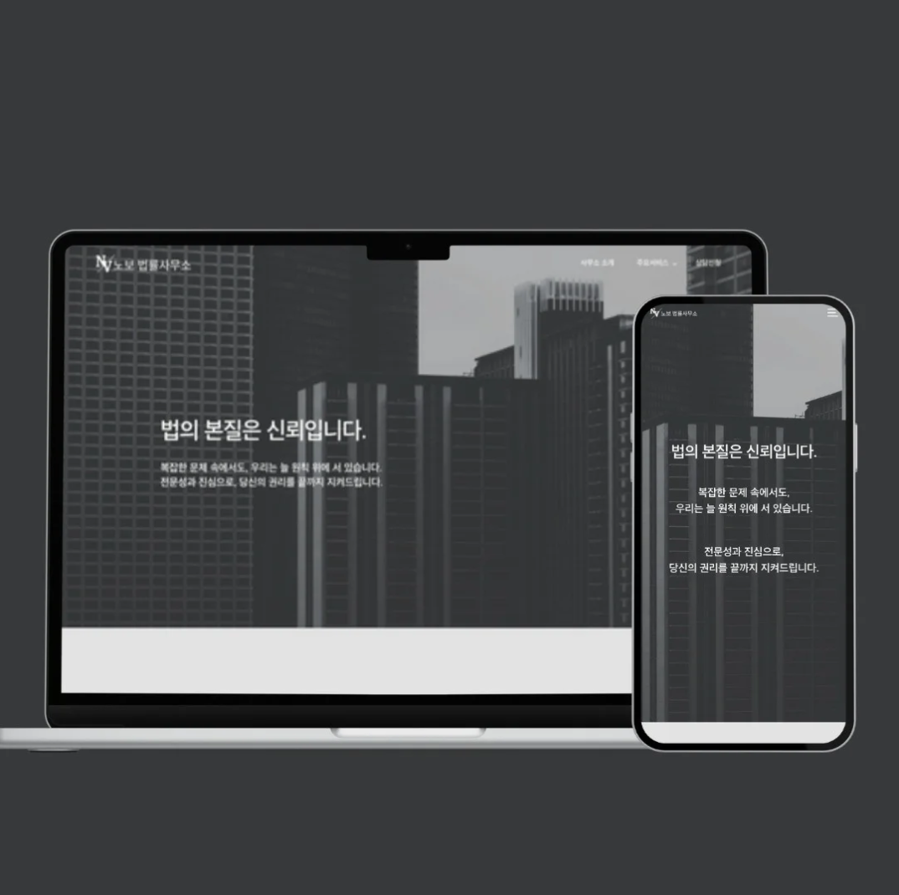

| 홈 섹션 | 변호사 소개 | 상담 신청 |
|---|---|---|
| 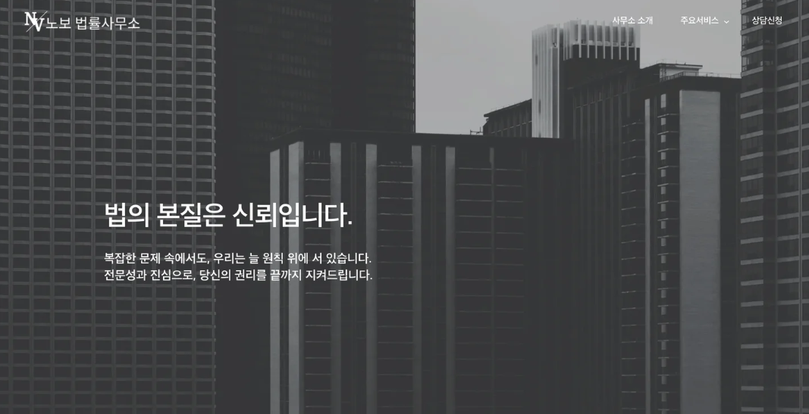 | 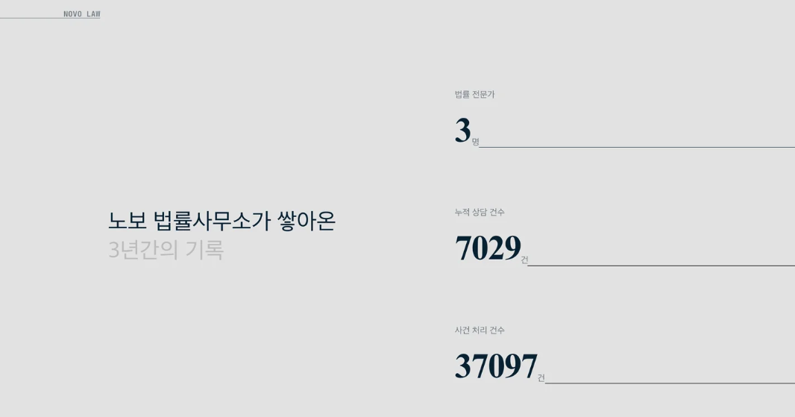 | 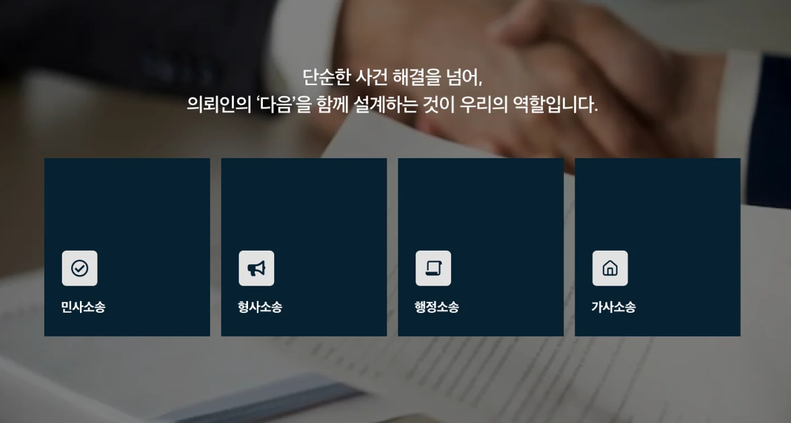 |

---

## 2) 스타트업 회사 웹페이지
- FE 구현(Vite/React) · 반응형
- 포인트: 제품/기능 강조, 가벼운 애니메이션, 채용 섹션

  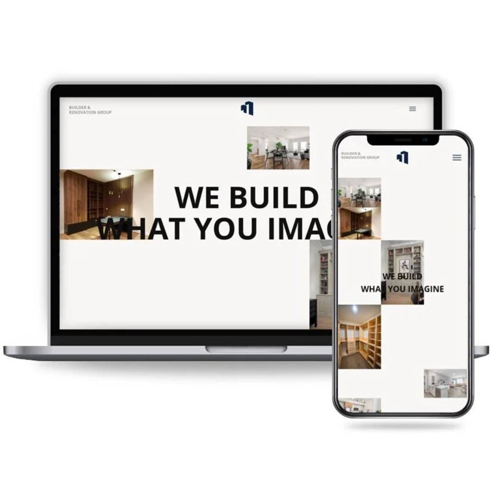

| 홈 | 제품/서비스 | 채용 |
|---|---|---|
| 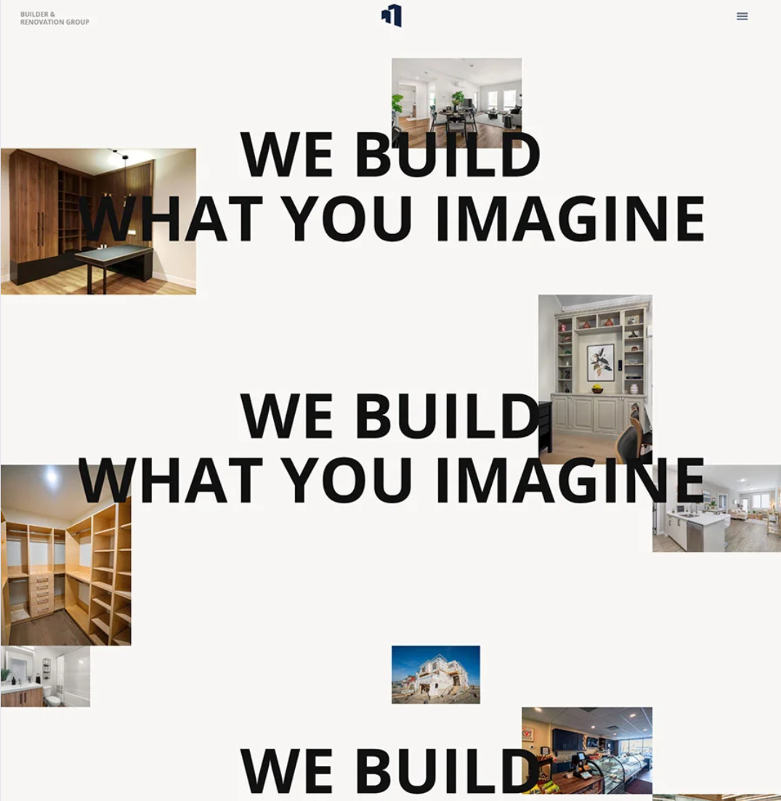 | 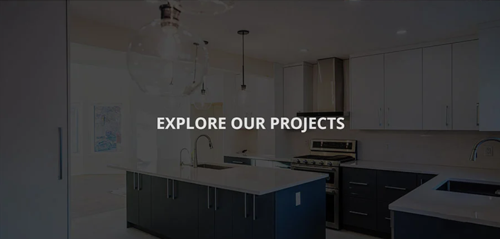 | 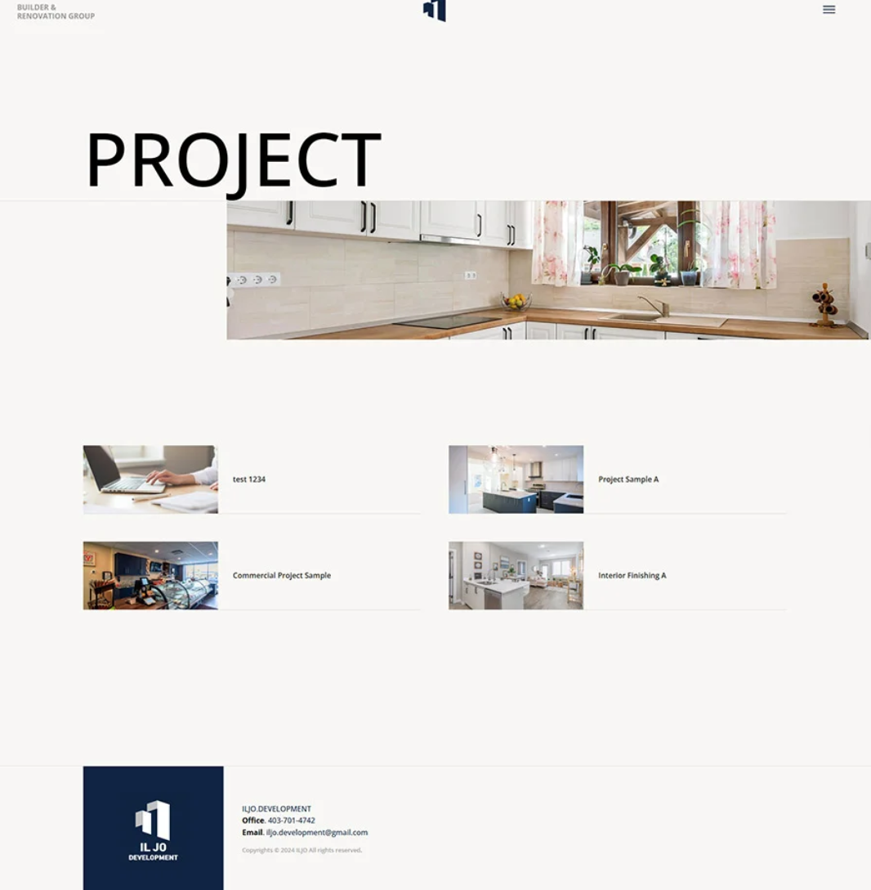 |

---

## 3) 마케팅 회사 웹페이지
- 퍼블리싱 · 반응형
- 포인트: 캠페인 사례 카드, 문의 유도 배너, 브랜드 톤&매너

  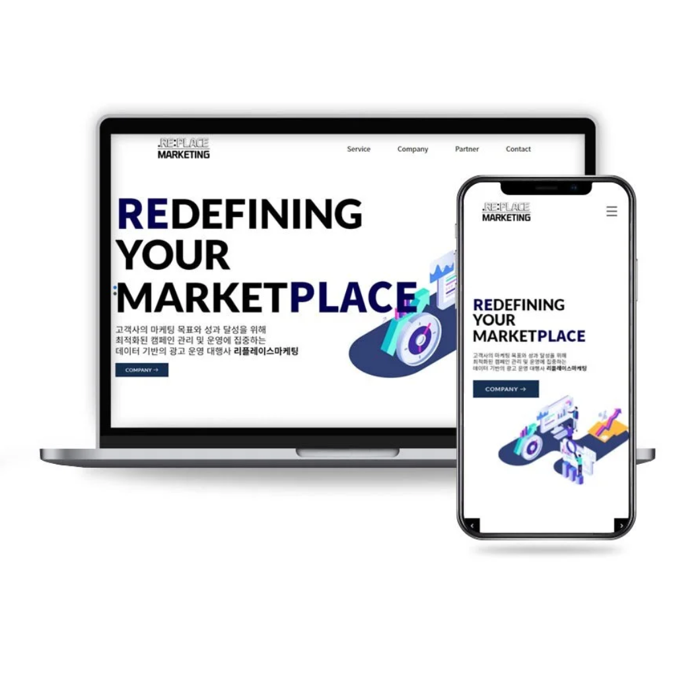

| 캠페인 사례 | 서비스 소개 | 문의 |
|---|---|---|
| 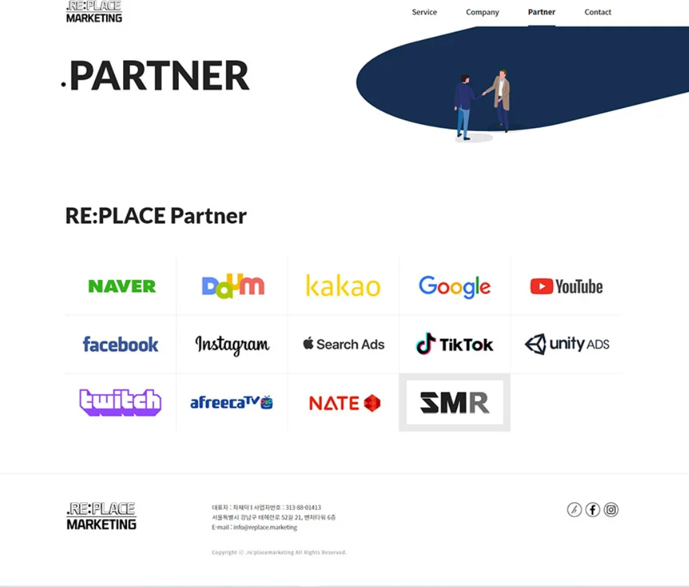 | 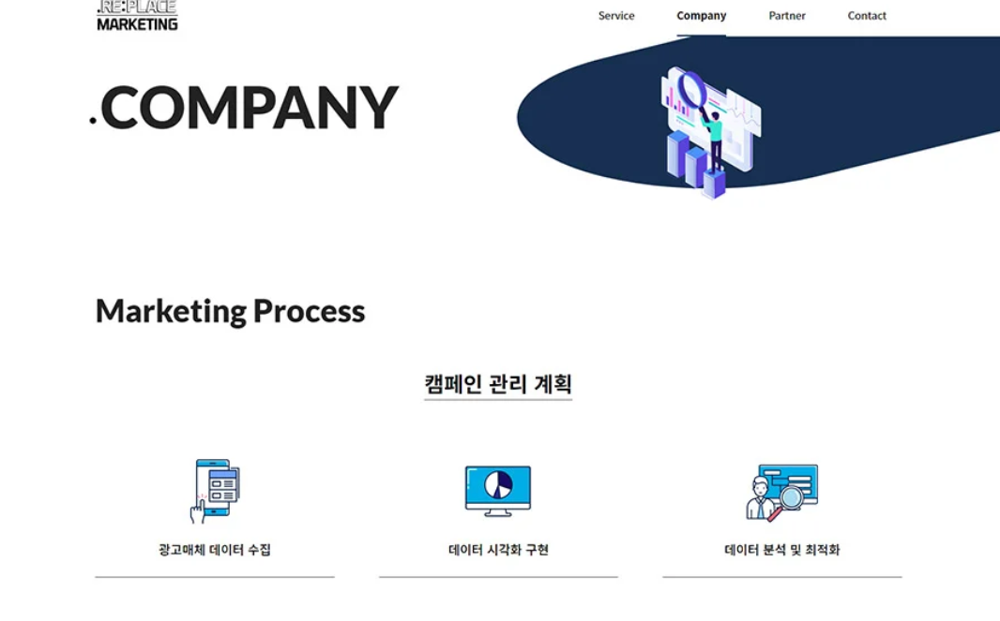 | 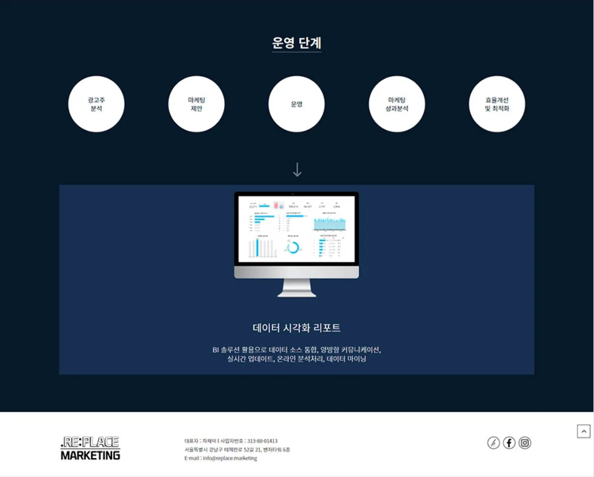 |
